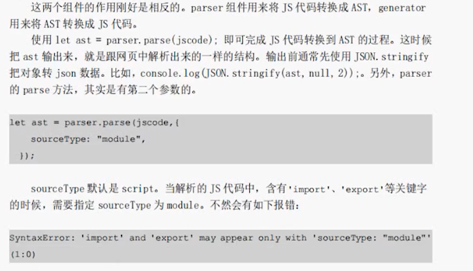

## @babel/parser

`@babel/parser` 是一个 JavaScript 解析器，由 Babel 团队开发，可以将 JavaScript 代码解析为抽象语法树（AST）。抽象语法树是一种用于表示源代码结构的树形表示形式，可以方便地对其进行查询和修改。

`@babel/parser` 是 Babel 编译器的核心组成部分之一，它可以将 ECMAScript 2015+ 代码解析为 AST，并提供了许多用于解析和生成 AST 的实用工具和 API。这个解析器具有以下特点：

- 支持 ECMAScript 2015+ 语法。
- 可扩展性：支持自定义插件和配置。
- 灵活性：支持解析 JavaScript 代码的多种形式，如 CommonJS、AMD 等。
- 高效性：具有高效的解析速度和内存使用。
- 提供了用于操作 AST 的 API 和实用工具。

`@babel/parser` 可以与其他 Babel 工具（如 `@babel/generator`、`@babel/traverse` 等）配合使用，用于实现 JavaScript 代码的编译、转换、分析和生成等功能。



```js
export function parse(
  input: string,//需要解析代码字符串
  options?: ParserOptions //可选参数，在解析过程中一些配置项 关于配置项内容在下面会讲解
): import("@babel/types").File; //返回是@babel/types 里面的File类型这个在下面介绍@babel/types时候会讲到
//关于ParserOptions 参数声明如下
export interface ParserOptions {
  /**
   * By default, import and export declarations can only appear at a program's top level.
   * 默认情况下，导入和导出声明只能出现在程序的顶层
   * Setting this option to true allows them anywhere where a statement is allowed.
   * 将此选项设置为true允许在任何允许语句的地方使用。
   */
  allowImportExportEverywhere?: boolean;

  /**
   * By default, await use is not allowed outside of an async function.
   * 默认情况下，不允许在异步函数之外使用await。
   * Set this to true to accept such code.
   * 将此设置为true以接受这样的代码。
   */
  allowAwaitOutsideFunction?: boolean;

  /**
   * By default, a return statement at the top level raises an error.
   * 默认情况下，顶层的return语句会引发错误。
   * Set this to true to accept such code.
   * 将此设置为true以接受这样的代码。
   */
  allowReturnOutsideFunction?: boolean;
　/**
　* By default, super use is not allowed outside of class and object methods. 
　* 默认情况下，不允许在类和对象方法之外super
　* Set this to true to accept such code. 
　* 将此设置为true以接受这样的代码。
  */
  allowSuperOutsideMethod?: boolean;

  /**
   * By default, exported identifiers must refer to a declared variable.
   * 默认情况下，导出的标识符必须引用声明的变量。
   * Set this to true to allow export statements to reference undeclared variables.
   * 将此设置为true以允许导出语句引用未声明的变量。
   */
  allowUndeclaredExports?: boolean;

  /**
   * By default, Babel always throws an error when it finds some invalid code.
   * 默认情况下，Babel在发现无效代码时总是抛出错误。
   * When this option is set to true, it will store the parsing error and
   * try to continue parsing the invalid input file.
   * 当该选项设置为true时，它将存储解析错误和尝试继续解析无效的输入文件
   */
  errorRecovery?: boolean;

  /**
   * Indicate the mode the code should be parsed in.
   * 指出代码应该被解析的模式。
   * Can be one of "script", "module", or "unambiguous". Defaults to "script".
   * 可以是“script”、“module”或“unambiguous”之一。默认为“script”。
   * "unambiguous" will make @babel/parser attempt to guess, based on the presence
   * of ES6 import or export statements.
   * “unambiguous”将使@babel/parser尝试猜测，基于存在ES6导入或导出语句的
   * Files with ES6 imports and exports are considered "module" and are otherwise "script".
   * 带有ES6导入和导出的文件被认为是“module”，否则就是“script”。
   */
  sourceType?: "script" | "module" | "unambiguous";

  /**
   * Correlate output AST nodes with their source filename.
   * 将输出AST节点与其源文件名关联起来。
   * Useful when generating code and source maps from the ASTs of multiple input files.
   * 在从多个输入文件的ast生成代码和源代码映射时很有用。
   */
  sourceFilename?: string;

  /**
   * By default, the first line of code parsed is treated as line 1.
   * 默认情况下，第一行代码被解析为第1行。
   * You can provide a line number to alternatively start with.
   * 您可以提供一个行号作为开头。
   * Useful for integration with other source tools.
   * 对于与其他源工具的集成很有用。
   */
  startLine?: number;

  /**
   * Array containing the plugins that you want to enable.
   * 包含要启用的插件的数组
   */
  plugins?: ParserPlugin[];

  /**
   * Should the parser work in strict mode.
   * 解析器是否在严格模式下工作
   * Defaults to true if sourceType === 'module'. Otherwise, false.
   * 如果sourceType === 'module'默认为true。否则,假的。
   */
  strictMode?: boolean;

  /**
   * Adds a ranges property to each node: [node.start, node.end]
   * 是否向每个节点添加一个ranges属性:[node.start, node.end]
  ranges?: boolean;

  /**
   * Adds all parsed tokens to a tokens property on the File node.
   * 将所有已解析的标记添加到File节点上的tokens属性。
   */
  tokens?: boolean;

  /**
   * By default, the parser adds information about parentheses by setting
   * 默认情况下，解析器通过设置来添加关于圆括号的信息
   * `extra.parenthesized` to `true` as needed.
   * When this option is `true` the parser creates `ParenthesizedExpression`
   * 当该选项为“true”时，解析器会创建`ParenthesizedExpression`
   * AST nodes instead of using the `extra` property.
   */
  createParenthesizedExpressions?: boolean;
}
```


关于options
首先解释一下AST ：Abstract syntax tree 的缩写翻译过来就是抽象语法树 至于抽象语法书的结构是如何的会在@babel/types，babel有提供一个在线查看网站https://astexplorer.net/

其次关于options的定义是我自己翻译如果有错误反应指正，再次强调注意版本，我是直接取的@babel/parser的声明文件，如果不太理解可以去学习一下ts的声明文件相关的知识。

options的相关都有很明确的解释我这里只额外说两项：

sourceType 它有三个配置项分别是：“script” | “module” | “unambiguous”，我们经常用的话一般用"script"和"module"，而他们两在使用的时候怎么区分存在import/export我们就用"module"反之就是保持默认的"script"，而“unambiguous”是表示我们以ES6的语法导入导出。
SyntaxError: ‘import’ and ‘export’ may appear only with ‘sourceType: “module”’
项目开发中遇到类似报错就表示我们sourceType配置错误


## @babel/generator

`@babel/generator`是Babel的一个子模块，用于从Babel的抽象语法树（AST）生成JavaScript代码。Babel是一个流行的JavaScript编译器，用于将ES6和更高版本的JavaScript代码编译成可在当前和旧版浏览器中运行的ES5代码。

`@babel/generator`模块的主要功能是将Babel的AST转换为JavaScript代码。它提供了一组API，允许开发人员通过指定所需的输出格式、插入注释、使用特定的格式化选项等方式来自定义生成的代码。

以下是使用`@babel/generator`模块生成JavaScript代码的基本示例：

```js
const babel = require('@babel/core');
const generator = require('@babel/generator');
 
const code = `function square(n) {
  return n * n;
}`;
 
const ast = babel.parseSync(code);
 
const result = generator(ast, { comments: true }, code);
 
console.log(result.code);
```

上述代码首先使用`@babel/core`模块的`parseSync`函数将给定的JavaScript代码解析为AST。然后，`generator`函数用于从AST生成JavaScript代码，并使用`comments`选项来保留注释。最后，生成的代码被打印到控制台。

使用`@babel/generator`可以灵活地控制生成的代码的格式和结构，使其成为开发人员和团队在处理JavaScript代码转换和格式化时的有用工具。


## @babel/traverse

`@babel/traverse` 是 Babel 库的一个子模块，用于遍历 JavaScript 代码的抽象语法树（AST）。Babel 是一个广泛使用的 JavaScript 编译器，用于将较新的 JavaScript（如 ES6 和更高版本）编译为向后兼容的 JavaScript（例如 ES5）。

`@babel/traverse` 允许您遍历 AST 并对每个节点进行操作。例如，您可以使用 `@babel/traverse` 来查找特定的 AST 节点，或者对 AST 进行一些转换。这种能力使得它非常适合于需要进行复杂的源代码分析和修改的任务。

使用 `@babel/traverse` 的基本步骤包括：

1. 首先，需要使用 Babel 的 `parse` 方法将源代码转换为 AST。
2. 然后，使用 `traverse` 方法的 `traverse` 函数来遍历 AST。这个函数接受两个参数：一个 AST 和一个包含您希望在遍历过程中执行的回调的选项对象。
3. 在回调中，您可以对 AST 的每个节点进行处理。

例如：

```js
const babel = require('@babel/core');
const traverse = require('@babel/traverse').default;

const code = `function square(n) {
  return n * n;
}`;

const ast = babel.parse(code);

traverse(ast, {
  enter(path) {
    if (path.isIdentifier({ name: 'n' })) {
      path.replaceWith(babel.types.numericLiteral(1));
    }
  },
});

console.log(babel.transform(ast, { sourceMaps: true }).code);
```

在这个例子中，我们使用 `@babel/traverse` 来遍历 AST，并在进入函数 `square` 的参数 `n` 时将其替换为数字 `1`。这将使函数 `square` 无论传入什么参数都返回 `1`。最后，我们使用 `babel.transform` 将修改后的 AST 转换回源代码，并输出结果。

```
对语法树中特定的节点进行操作(特殊节点的函数)
进入节点（enter）
退出节点  (exit)
```


## @babel/types

`@babel/types` 是一个 Babel 库，提供了一些用于创建和操作 JavaScript 抽象语法树 (AST) 的基础类型和工具。这些类型和工具可以帮助你更方便地编写 Babel 插件、转换代码等等。

以下是一些 `@babel/types` 中常见的类型：

- `Identifier`：表示 AST 中的标识符节点。
- `Literal`：表示 AST 中的字面量节点。
- `MemberExpression`：表示 AST 中的成员表达式节点。
- `CallExpression`：表示 AST 中的调用表达式节点。
- `ArrayExpression`：表示 AST 中的数组表达式节点。
- `ObjectExpression`：表示 AST 中的对象表达式节点。
- `Program`：表示 AST 中的程序节点。

除了这些基本类型之外，`@babel/types` 还提供了一些实用工具，例如：

- `buildMatchMemberExpression`：用于构建匹配成员表达式的正则表达式。
- `buildMatchPattern`：用于构建匹配模式表达式的正则表达式。
- `validatePattern`：用于验证模式表达式的语法。
- `inherit`：用于继承 AST 节点。
- `replaceWith`：用于在 AST 中替换节点。
- `isIdentifierName`：用于检查 AST 节点是否为标识符名称。
- `isLiteralType`：用于检查 AST 节点的类型是否为字面量类型。

你可以使用 npm 安装 `@babel/types`，例如：

```
npm install --save @babel/types
```

在 JavaScript 文件中引入 `@babel/types`：

```
const t = require('@babel/types');
```

使用 `@babel/types` 创建 AST 节点：

```
const program = t.program([
  t.classDeclaration(null, [
    t.classProperty(null, 'x', t.numberLiteral(10))
  ])
]);
```
